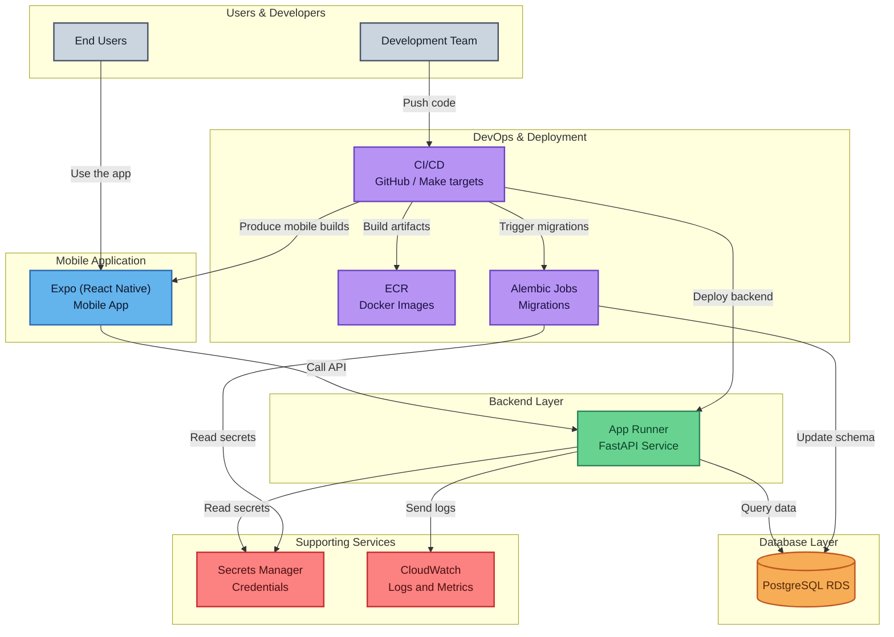

## Project Overview

Guelp is a school management platform composed of a FastAPI backend, a React Native mobile app built with Expo Router, and Terraform-based infrastructure. The goal is to let students, teachers, and administrators collaborate on grades, schedules, and roster management through secure role-based experiences.

- **Students** review current and past subjects, grades, and schedules.
- **Teachers** manage classroom rosters, record qualifications (with AD/A/B/C/D scale), and monitor averages.
- **Administrators** oversee user creation, roles, classrooms, and subjects.

Authentication uses JWT access/refresh tokens retrieved from `/auth/login`. Tokens are stored securely on-device and refreshed automatically; logout clears stored credentials.

## Main Components

- `backend/` – FastAPI service with SQLModel/SQLAlchemy, Alembic migrations, and modular use-cases for auth, roster management, and grading workflows.
- `mob/` – React Native (TypeScript) app using Expo Router, React Query, and secure token storage to deliver Spanish-localised flows for students, teachers, and admins.
- `infrastructure/` – Terraform configuration that provisions AWS App Runner for the API, an RDS PostgreSQL instance, secrets, networking, and supporting resources. A Makefile encapsulates common deployment tasks.

## Solution Highlights

- **Role-driven navigation** routes users to their respective stacks after login (student, teacher, admin).
- **Qualification management** gives teachers history tracking, deletion, and automatic average recalculation.
- **Accessibility & resilience** include offline-friendly messaging, large-text friendly layouts, and consistent handling of active/inactive enrolments.
- **Audit metadata**: all protected API responses echo the requesting user’s roles/permissions for traceability.

## Infrastructure at a Glance

Terraform modules under `infrastructure/` orchestrate networking, security groups, App Runner, and RDS. The Makefile streamlines init, plan, apply, and destroy commands for each environment (e.g., `make plan ENV=production`).

- **App Runner** hosts the FastAPI image and communicates with RDS through security-group rules.
- **RDS PostgreSQL** stores users, roles, classrooms, subjects, and grading data.
- **Subnets & security groups** restrict traffic, keeping the database private.

## Development & Testing Summary

- **Local backend**: `uvicorn` run via Docker Compose; Alembic handles schema migrations and seed data.
- **Mobile app**: Expo CLI for web/Android/iOS previews; EAS Build produces production bundles and APKs.
- **Data resets**: Make targets (`reset-db`, migration commands) support clearing and reseeding demo records.

## Release & Operations

- **Deployments**: Terraform applies create/update infrastructure; App Runner fetches the latest container image. CI/CD (if configured) can automate the build-and-deploy pipeline.
- **Database migrations**: run Alembic upgrades against the RDS instance before or during deployments to keep schemas in sync.
- **Monitoring**: App Runner metrics and AWS CloudWatch logs capture backend health; Expo EAS gives build logs for mobile releases.

## Quick Reference

- **Authentication:** JWTs from `/auth/login`, includes role and permission claims.
- **Grade scale:** AD = 20, A = 17, B = 14, C = 10, D = 5.
- **Key endpoints:** `/students/{id}/subjects`, `/teachers/{id}/classrooms`, `/teachers/{id}/qualifications`, `/roles`, `/subjects`, `/classrooms`.
- **Expo build tips:** use `eas build --platform android --profile preview-apk` for APKs and `eas build --platform android --profile production` for AABs.

## Audience Notes

This document is intentionally high level for product and project managers, designers, and developers who need to understand the scope without diving into implementation specifics. For deeper technical detail, consult the module-level READMEs inside `backend/`, `mob/`, and `infrastructure/`.

