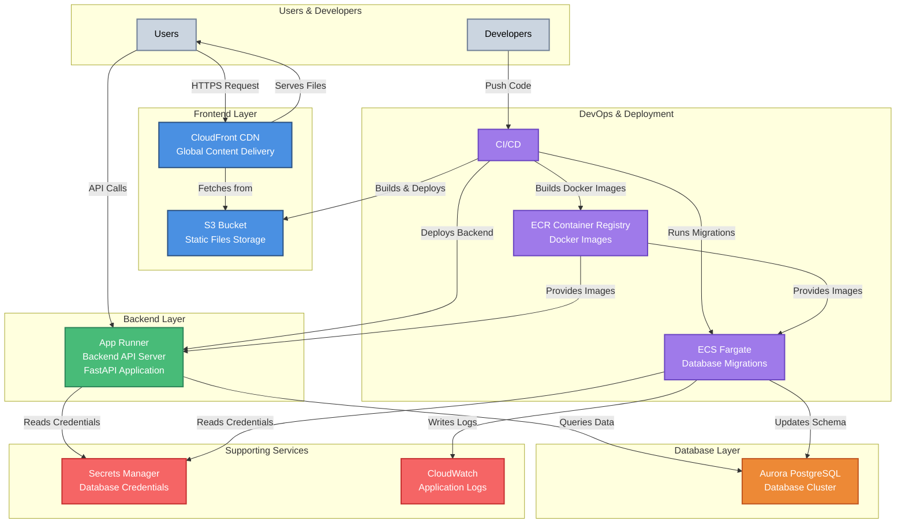

# Infrastructure Documentation

This directory contains Terraform configurations for provisioning AWS infrastructure for the full-stack application.

## Architecture Overview

The infrastructure is deployed on AWS and consists of the following components:

### Core Components

- **Frontend**: React application served via CloudFront CDN from S3
- **Backend API**: FastAPI application running on AWS App Runner
- **Database**: Aurora PostgreSQL cluster
- **CI/CD**: Repository Actions for automated deployments
- **Container Registry**: ECR for Docker images
- **Secrets Management**: AWS Secrets Manager for credentials

## Infrastructure Diagram



### Simple Overview (For Developers & Project Managers)

**How it works:**

1. **Users** access the application through a CDN (CloudFront) which serves static files from S3
2. **Frontend** (React app) makes API calls to the **Backend** (FastAPI running on App Runner)
3. **Backend** connects to the **Database** (Aurora PostgreSQL) to fetch/store data
4. **Developers** push code to Repository, which automatically:
   - Builds and deploys the frontend to S3
   - Builds Docker images and deploys the backend
   - Runs database migrations when needed

**Key Components:**
- **CloudFront + S3**: Frontend hosting and global content delivery
- **App Runner**: Backend API server (auto-scales, no server management)
- **Aurora PostgreSQL**: Managed database (automatic backups, high availability)
- **Repository Actions**: Automated deployment pipeline
- **ECR**: Docker image storage
- **ECS**: Runs database migrations automatically


## Usage

### Initialize Terraform
```bash
make init
```

### Plan Changes
```bash
make plan
```

### Apply Changes
```bash
make apply
```

### Deploy Only ECR Repositories
```bash
make apply-ecr
```

### Destroy Infrastructure
```bash
make destroy
```

### Unlock State (if locked)
```bash
make unlock LOCK_ID=<lock-id>
```

## Troubleshooting

- **State Lock Error**: Use `make unlock LOCK_ID=<id>` to release lock
- **Migration Task Fails**: Check CloudWatch Logs for ECS task details
- **Frontend Not Updating**: Verify CloudFront cache invalidation completed
